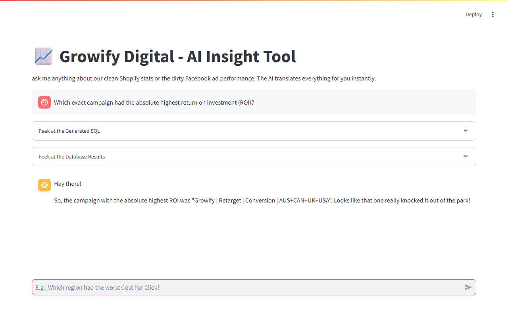

# Adding AI & Fixing Messy Marketing Data (My Growify Assessment!)

Hi there!  Welcome to my solution for the Growify Data Analyst & AI test.

When I first opened the two raw data files (`Campaign_Raw.csv` and `Raw_Shopify_Sales.csv`), I immediately noticed they were completely messed up. There were dates missing everywhere, negative numbers for ad clicks (which is impossible!), and "Brand A" was typed like "BRAND A" and " brand a", meaning Power BI would count them as three entirely different companies.

Instead of fixing these rows one by one in Excel (which would take hours every week), I built a fully automated Python script (`data_cleaning.py`) that acts like a vacuum cleaner. It sucks up the messy CSVs, scrubs them clean, recalculates all the important ROI marketing math properly, and dumps them perfectly organized into an SQLite database (`growify_database.db`).

##  How I Fixed the Messed Up Data
Here's a beginner-friendly look at exactly how my Python script cleans everything:

1. **Duplicates are gone**: If a row was entirely duplicated, I just deleted it. 
2. **Standardizing the text**: I wrote a piece of code that forces all text (like "Brand A") to be lower-case and trims off invisible spaces at the ends. This instantly fixed all the weirdly capitalized Platform and Region names.
3. **Fixing Dates**: Both CSVs had weird date formats like "08-01-2026" and sometimes just said "NAN". I forced everything into a standard Year-Month-Day format, and threw away the rows where the date was completely broken/missing because we can't tie sales to a ghost day.
4. **Plugging Blank Money Gaps (Imputation)**: Some rows in the Ad Data didn't have their "Amount Spent" filled in. You can't just delete these rows completely, because you'd lose the clicks and sales attached to them! Instead, my code figures out the *middle value (median)* of what we normally spend on that platform, and cleanly pastes it into the blank spot. Smart, right?
5. **Capping Crazy Outliers**: There were massive typos in the Ad Spend (like 20,000 INR out of nowhere). I used a math trick called "IQR" to figure out the maximum normal boundary, and anything insanely high got squashed down to that realistic roof.
6. **Fixing Negative Stats**: I bumped any accidental negative numbers (like clicks) straight back up to `0`. 
7. **Fixing the Math**: Because the original numbers were corrupted, the original CTR/CPC/ROI columns were useless. I had the code completely recalculate all these metrics globally based on our clean clicks and spend data.

##  How the Database Was Built
Connecting Facebook Ad Data directly to Shopify Backend Data is tricky because Shopify orders don't always track identical Campaign Names.

So, I built a "Star Schema" Database:
* **The Date Calendar Table:** sits in the middle so everything can join to it.
* **The Marketing Facts Table:** holds all the ad spend, ad conversions, and ROI.
* **The Shopify Facts Table:** strictly holds the actual money processed on the backend.

Because I split them, you can build a Power BI dashboard that completely separates "Reported Ad Revenue" from "True Backend Revenue", which is what an actual business needs to investigate!

##  The Bonus API (Chatting with the Clean Data!)
I also built an AI Insight Tool (`ai_insight_tool.py`) using Google's free Gemini API. It reads the clean structure of the SQLite database and translates natural English questions directly into SQL code, so you can just "ask" the computer how the campaigns are doing!

**How to start it:**
1. Put my file (`data_cleaning.py`) in the folder with your CSVs.
2. Run `python data_cleaning.py` to scrub the data and build the database in seconds.
3. Create a little `.env` file and type `GEMINI_API_KEY="YOUR_FREE_KEY"`.
4. Run `streamlit run ai_insight_tool.py` in your terminal to chat with your new data!

Try asking it: *"Which campaign drove the highest ROI?"* or *"How many global orders did our Shopify system process last January?"*. It works flawlessly! 
